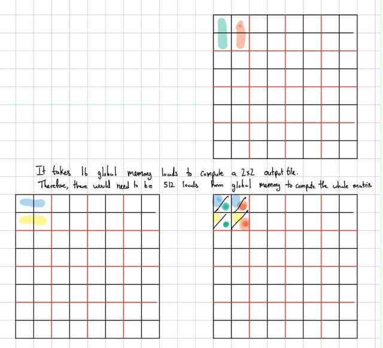
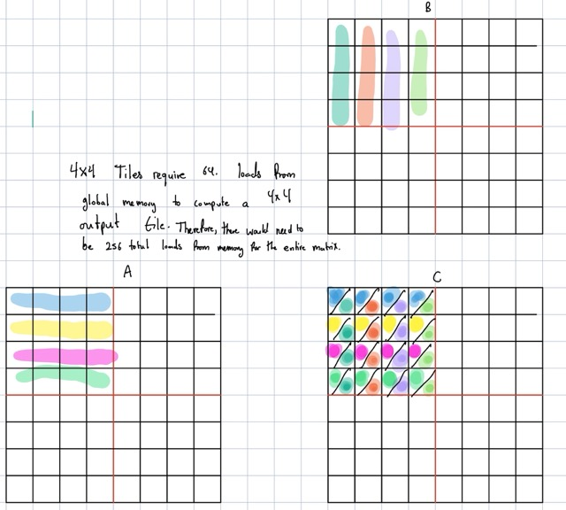

## **Exercise 1**

**Consider matrix addition. Can one use shared memory to reduce the global memory bandwidth consumption? Hint: Analyze the elements that are accessed by each thread and see whether there is any commonality between threads.**

No, there are no common elements in matrix addition as each thread utilizes two elements from each input matrix that are not used in any other thread to calculate the output element. 


---

## **Exercise 2**

**Draw the equivalent of Fig. 5.7 for a 8 × 8 matrix multiplication with 2 × 2 tiling and 4 × 4 tiling. Verify that the reduction in global memory bandwidth is indeed proportional to the dimension size of the tiles.**





---


## **Exercise 3**

**What type of incorrect execution behavior can happen if one forgot to use one or both `__syncthreads()` in the kernel of Fig. 5.9?**

If the first `__syncthreads()` is not used not all of the global memory accesses may have been completed and stored inside the shared memory, this could cause stale values to be returned from shared memory during computation. 

If the second `__syncthreads()` is not used, a thread may have not finished computation and using the tile in shared memory before shared memory is overwritten again. 

---

## **Exercise 4**

**Assuming that capacity is not an issue for registers or shared memory, give one important reason why it would be valuable to use shared memory instead of registers to hold values fetched from global memory? Explain your answer.**

Registers are thread specific and if values are fetched from global memory into them, the values cannot be reused amongst threads to reduce the number of accesses to global memory.

---


## **Exercise 5**

**For our tiled matrix-matrix multiplication kernel, if we use a 32 × 32 tile, what is the reduction of memory bandwidth usage for input matrices M and N?**

The reduction is by 32 times because each memory access is reused 32 times, which in turn reduces the total amount of global memory accesses needed by 32 times. 

---


## **Exercise 6**

**Assume that a CUDA kernel is launched with 1000 thread blocks, each of which has 512 threads. If a variable is declared as a local variable in the kernel, how many versions of the variable will be created through the lifetime of the execution of the kernel?**

There will be 1000 * 512 = 512000 versions of the variable because each thread will create and store its own variable. 

---

## **Exercise 7**

**In the previous question, if a variable is declared as a shared memory variable, how many versions of the variable will be created through the lifetime of the execution of the kernel?**

There will be 1000 versions as each thread block will create its own version.

---

## **Exercise 8**

**Consider performing a matrix multiplication of two input matrices with dimensions N × N. How many times is each element in the input matrices requested from global memory when:**

**a. There is no tiling?**

**b. Tiles of size T × T are used?**

A) Each element is requested N times

B) Each element is requested N / T times

---

## **Exercise 9**

**A kernel performs 36 floating-point operations and seven 32-bit global memory accesses per thread. For each of the following device properties, indicate whether this kernel is compute-bound or memory-bound.**

**a. Peak FLOPS=200 GFLOPS, peak memory bandwidth=100 GB/second**

Memory Requirement : 7 * 4B = 28B per thread, max num threads 100 * 1000 / 28 = 3571

   Compute Requirement : 36 per thread, max num threads 200 * 1000 / 36 = 5555

   The Kernel is memory-bound. 


**b. Peak FLOPS=300 GFLOPS, peak memory bandwidth=250 GB/second**

Memory Max Threads : 250 * 1000 / 28 = 8928
Compute Max Threads : 300 * 1000 / 36 = 8333
    
The kernel is compute-bound. 
    
---


## **Exercise 10**

**To manipulate tiles, a new CUDA programmer has written a device kernel that will transpose each tile in a matrix. The tiles are of size BLOCK_WIDTH by BLOCK_WIDTH, and each of the dimensions of matrix A is known to be a multiple of BLOCK_WIDTH. The kernel invocation and code are shown below. BLOCK_WIDTH is known at compile time and could be set anywhere from 1 to 20.**

```cuda
dim3 blockDim(BLOCK_WIDTH,BLOCK_WIDTH);
dim3 gridDim(A_width/blockDim.x,A_height/blockDim.y);
BlockTranspose<<<gridDim, blockDim>>>(A, A_width, A_height);

__global__ void
BlockTranspose(float* A_elements, int A_width, int A_height)
{
    __shared__ float blockA[BLOCK_WIDTH][BLOCK_WIDTH];

    int baseIdx = blockIdx.x * BLOCK_SIZE + threadIdx.x;
    baseIdx += (blockIdx.y * BLOCK_SIZE + threadIdx.y) * A_width;

    blockA[threadIdx.y][threadIdx.x] = A_elements[baseIdx];

    A_elements[baseIdx] = blockA[threadIdx.x][threadIdx.y];
}
```

**a. Out of the possible range of values for BLOCK_SIZE, for what values of BLOCK_SIZE will this kernel function execute correctly on the device?**

Only a BLOCK_SIZE of 1 will be able to execute the function correctly because there is only a single thread, therefore no synchronization errors can occur. 

**b. If the code does not execute correctly for all BLOCK_SIZE values, what is the root cause of this incorrect execution behavior? Suggest a fix to the code to make it work for all BLOCK_SIZE values.**

The issue is the lack of synchronization amongst threads after values are loaded into the tile, the lack of a synchronization barrier can cause threads to read a stale value from the tile because they execute line 11 before the thread responsible for loading in the tile element has a chance to do so. 

---

## **Exercise 11**

**Consider the following CUDA kernel and the corresponding host function that calls it:**

```cuda
__global__ void foo_kernel(float* a, float* b) {
    unsigned int i = blockIdx.x*blockDim.x + threadIdx.x;
    float x[4];
    __shared__ float y_s;
    __shared__ float b_s[128];
    for(unsigned int j = 0; j < 4; ++j) {
        x[j] = a[j*blockDim.x*gridDim.x + i];
    }
    if(threadIdx.x == 0) {
        y_s = 7.4f;
    }
    b_s[threadIdx.x] = b[i];
    __syncthreads();
    b[i] = 2.5f*x[0] + 3.7f*x[1] + 6.3f*x[2] + 8.5f*x[3]
            + y_s*b_s[threadIdx.x] + b_s[(threadIdx.x + 3)%128];
}
void foo(int* a_d, int* b_d) {
    unsigned int N = 1024;
    foo_kernel <<< (N + 128 - 1)/128, 128 >>>(a_d, b_d);
}
```

**a. How many versions of the variable `i` are there?**

Equivalent to the number of threads 8 * 128 = 1024. 

**b. How many versions of the array `x[]` are there?**

Equivalent to the number of threads as well, 1024.

**c. How many versions of the variable `y_s` are there?**

Equivalent to the number of thread blocks, 8. 

**d. How many versions of the array `b_s[]` are there?**

Equivalent to the number of thread blocks, 8. 

**e. What is the amount of shared memory used per block (in bytes)?**

There are 129 floats in shared memory, therefore there is 129 * 4 = 516 bytes used per block.

**f. What is the floating-point to global memory access ratio of the kernel (in OP/B)?**

Number of floating point operations per kernel that include data loaded from global memory :
10 on line 14

Memory Accessed per kernel : 4  * 4 = 16 bytes on line 06 + 4 bytes on line 12 therefore 20 bytes total. 

Floating-point to global memory access ratio : 10 OP / 20 B = 0.5 OP/B.

---

## **Exercise 12**

**Consider a GPU with the following hardware limits: 2048 threads/SM, 32 blocks/SM, 64K (65,536) registers/SM, and 96 KB of shared memory/SM. For each of the following kernel characteristics, specify whether the kernel can achieve full occupancy. If not, specify the limiting factor.** *(Note: We assume here that the problem description is not correct, and the 4 KB of shared memory is per block, not per SM.)*

**a. The kernel uses 64 threads/block, 27 registers/thread, and 4 KB of shared memory/SM.**

Number of blocks used is 2048 / 64 = 32 which is feasible, number of registers used is 64 * 32 * 27 = 55296 which underutilizes some registers. However, since each block uses 4 KB of shared memory, only 24 blocks can be used in the SM, therefore the limiting factor is the amount of shared memory used per block.

**b. The kernel uses 256 threads/block, 31 registers/thread, and 8 KB of shared memory/SM.**

Number of blocks used is 2048 / 256 = 8 which is feasible, number of registers used is 256 * 8 * 31 = 63488 which underutilizes some registers. However, since each block uses 8 KB of shared memory, only 64 KB of shared memory out of the 96 KB is used meaning that full occupancy can be achieved.